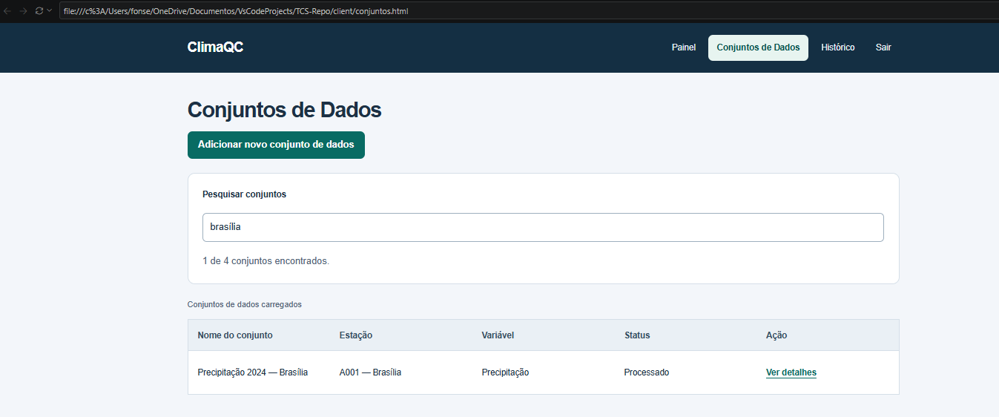
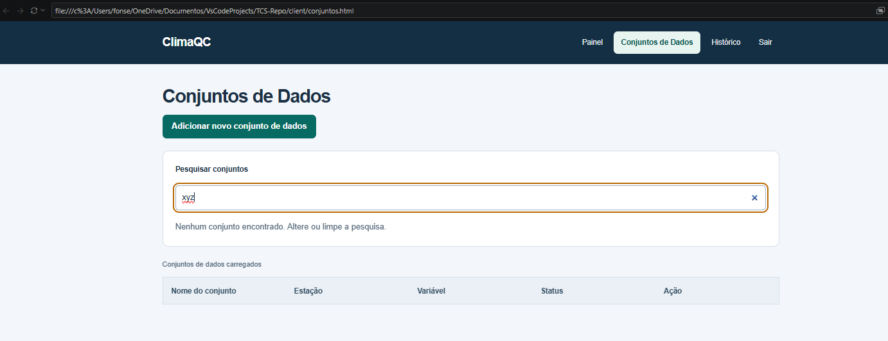
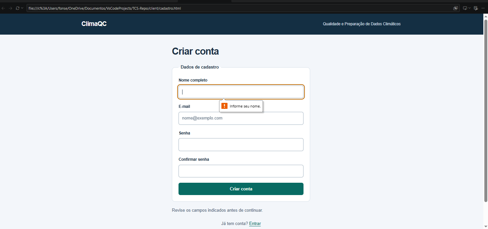
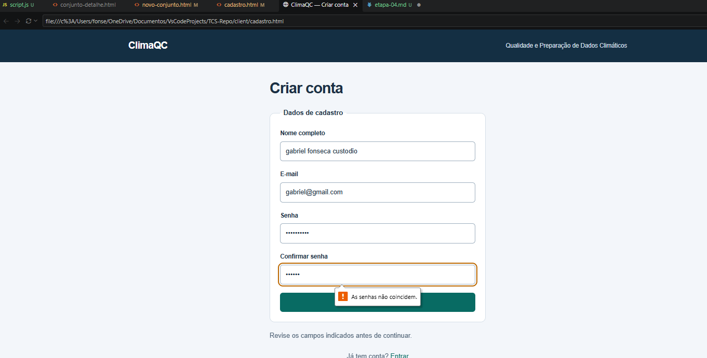
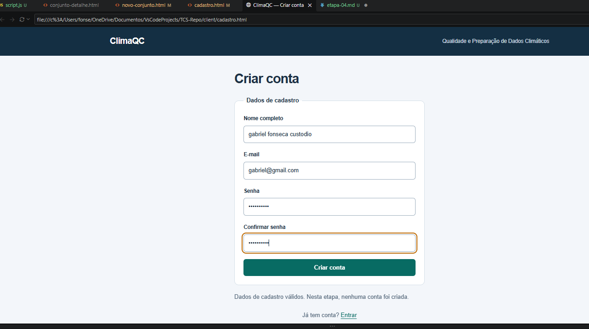
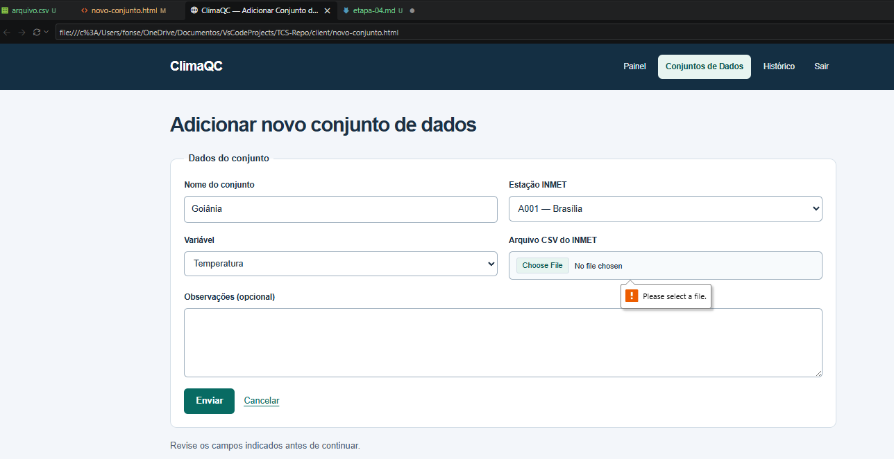
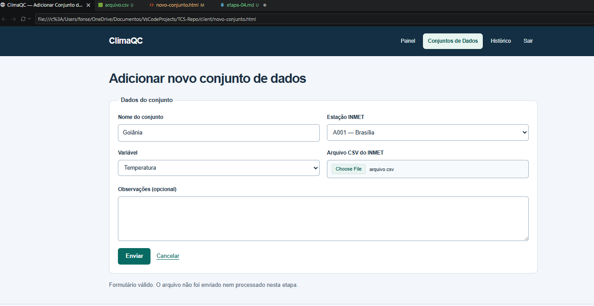

# Etapa 04 — Interatividade com JavaScript

## Objetivo

Adicionar interatividade ao ClimaQC utilizando JavaScript, com pesquisa
de conjuntos de dados e validação de formulários.

## Arquivos envolvidos

- client/script.js
- client/conjuntos.html
- client/cadastro.html
- client/novo-conjunto.html

As três páginas HTML carregam o JavaScript por meio de:

## 1. Pesquisa de conjuntos

Na página conjuntos.html, o JavaScript cria um campo de pesquisa
acima da tabela.

Conforme o usuário digita, as linhas são filtradas pelo nome do
conjunto, estação, variável ou status. A pesquisa desconsidera
diferenças entre letras maiúsculas, minúsculas e acentos.

A interface informa quantos conjuntos foram encontrados.
Quando não existem resultados, apresenta uma mensagem.
Ao limpar a pesquisa, todas as linhas voltam a aparecer.

Arquivos: client/conjuntos.html e client/script.js.

Funções principais: iniciarPesquisa e normalizarTexto.

### Como testar

1. Abra conjuntos.html.
2. Digite "brasilia" e verifique que o conjunto de Brasília aparece.
3. Digite "temperatura" e confira os conjuntos correspondentes.
4. Digite "xyz" e verifique a mensagem de nenhum resultado.
5. Limpe a pesquisa e confira se todas as linhas reaparecem.

## 2. Validação do cadastro

Na página cadastro.html, o JavaScript valida os dados ao clicar
em "Criar conta".

São verificados:

- Nome obrigatório, sem aceitar apenas espaços.
- E-mail obrigatório e com formato aceito pelo campo type="email".
- Senha obrigatória, sem aceitar apenas espaços.
- Confirmação de senha igual à senha informada.

Se houver algum erro, o formulário não prossegue e apresenta
uma indicação do campo inválido.

Quando os dados são válidos, uma mensagem é exibida.
Nesta etapa, nenhuma conta é criada e os dados não são salvos.

Arquivos: client/cadastro.html e client/script.js.

Funções principais: iniciarCadastro e prepararFormulario.

### Como testar

1. Abra cadastro.html.
2. Clique em "Criar conta" sem preencher os campos.
3. Preencha o nome apenas com espaços e tente novamente.
4. Preencha o nome corretamente e informe um e-mail como "abc".
5. Corrija o e-mail e informe senhas diferentes.
6. Confira a mensagem de que as senhas não coincidem.
7. Preencha todos os campos corretamente, com senhas iguais.
8. Confira a mensagem de dados válidos.

## 3. Validação do novo conjunto

Na página novo-conjunto.html, o JavaScript valida o formulário
ao clicar em "Enviar".

São verificados:

- Nome obrigatório, sem aceitar apenas espaços.
- Seleção de uma estação.
- Seleção de uma variável.
- Seleção de um arquivo.
- Extensão .csv.
- Arquivo com tamanho maior que zero.

Quando os dados são válidos, uma mensagem é exibida.
O arquivo não é enviado nem processado nesta etapa.

A verificação de extensão e tamanho não analisa o conteúdo
interno do CSV.

Arquivos: client/novo-conjunto.html e client/script.js.

Funções principais: iniciarNovoConjunto e prepararFormulario.

### Como testar

1. Abra novo-conjunto.html.
2. Clique em "Enviar" sem preencher os campos.
3. Confira as indicações dos campos obrigatórios.
4. Preencha o nome e selecione uma estação e uma variável.
5. Selecione um arquivo .txt e confira o erro de extensão.
   Se necessário, escolha "Todos os arquivos" no seletor.
6. Selecione um arquivo .csv vazio e confira a mensagem de erro.
7. Selecione um arquivo .csv com conteúdo.
8. Clique em "Enviar" e confira a mensagem de formulário válido.

## Conceitos de programação utilizados

- Funções para organizar e reutilizar o código.
- Manipulação do DOM para criar elementos e atualizar mensagens.
- Eventos input, change e submit para responder às ações do usuário.
- Evento DOMContentLoaded para aguardar o carregamento do HTML.
- Arrays para representar as linhas da tabela.
- map para transformar elementos em registros pesquisáveis.
- filter para selecionar os registros correspondentes à pesquisa.
- forEach para atualizar a visibilidade das linhas.
- Condicionais para tratar campos e arquivos inválidos.
- preventDefault para impedir o envio dos formulários.
- setCustomValidity e reportValidity para validar os campos.

## Matriz de evidências

| Requisito | Funcionalidade relacionada | Arquivo(s) | Evidência |
|---|---|---|---|
| Manipulação do DOM | Pesquisa e mensagens | client/script.js | createElement, append e before criam e inserem elementos. |
| Tratamento de eventos | Pesquisa e formulários | client/script.js | addEventListener trata input, change e submit. |
| Validação de formulários | Cadastro e novo conjunto | client/script.js; client/cadastro.html; client/novo-conjunto.html | setCustomValidity e reportValidity verificam regras do JS e restrições do HTML. |
| Alteração dinâmica da interface | Pesquisa e mensagens | client/script.js | hidden controla as linhas e textContent atualiza as mensagens. |
| Uso de funções | As três funcionalidades | client/script.js | iniciarPesquisa, iniciarCadastro, iniciarNovoConjunto e prepararFormulario. |
| Uso de arrays | Pesquisa de conjuntos | client/script.js | Array.from cria o array usado na variável registros. |
| Métodos de iteração | Pesquisa de conjuntos | client/script.js | Uso de map, filter e forEach. |
| Tratamento de situações inválidas | Pesquisa e formulários | client/script.js | Mensagens para pesquisa sem resultados, campos inválidos, senhas diferentes e arquivos inválidos. |

## Execução

1. Abra a pasta do projeto no VS Code.
2. Abra uma das páginas HTML da pasta client no navegador
   ou por meio do Live Server.
3. Execute os testes descritos nas funcionalidades.

Esta etapa funciona no navegador e não exige backend.

## Evidências de funcionamento

### Pesquisa com resultado

### Pesquisa sem resultados

### cadastro sem preencher campos 

### Cadastro com senhas diferentes

### Cadastro com dados válidos

### Novo conjunto com arquivo inválido

### Novo conjunto com formulário válido

## Identificação da versão

Tag da entrega: etapa-04.